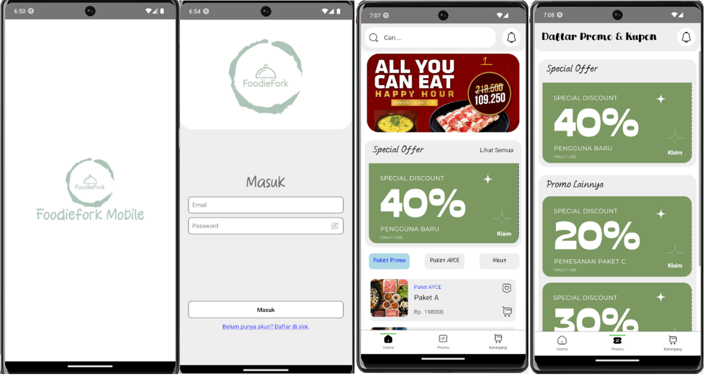

# FoodieFork Mobile: Restaurant Ordering Android App

This project is a **React Native Android application** designed for **FoodieFork restaurant**, allowing users to browse menus and place food orders directly through the app. The user interface (UI) was custom-designed to provide a smooth and interactive experience.

---

## 🚀 Features
- **Custom-designed UI** for intuitive navigation and ordering experience.  
- **User Authentication** using **Firebase Authentication** (email/password, Google login, etc.).  
- **Promo menu**: access coupons and special meal packages (including all-you-can-eat options).  
- **Ordering and payment**: users can place orders and pay directly within the app.  
- **Ratings and reviews**: provide feedback on previously ordered food.  
- **Favorites / Bookmarks**: save preferred dishes for quick access.  
- Real-time menu and promo updates.  

---

## 🛠️ Tech Stack
- **Framework**: React Native  
- **Platform**: Android  
- **Programming Language**: JavaScript / TypeScript  
- **Authentication**: Firebase Authentication  
- **UI Design**: Custom React Native components and layouts  
- **Minimum Android Version**: 13 (during development)  
- **Other Tools**: SQLite / Realm for local storage, REST API integration for backend services  

---

## 📊 System Workflow
1. User opens the app and logs in via **Firebase Authentication**.  
2. Users browse the menu and view **promotions and meal packages**, then select items to order.  
3. Orders can be **paid directly** in-app.  
4. Users can **rate and review** their previous orders.  
5. Users can **bookmark or favorite** menu items for future orders.  
6. App synchronizes with backend for promotions, menu updates, and order processing in real-time.  

---
